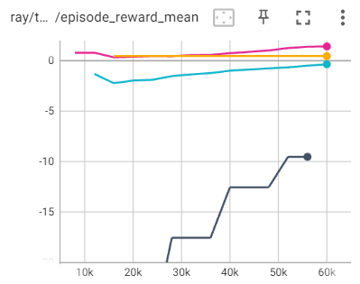

# Task 1

The point of the `"invalid_pickup_dense_penalty"` ($s_{f}$ for 'score of failing') is to penalize the agent for picking up the wrong object.

The agent can get a score of at most 3*0.5 = 1.5 = $s_{t}$ (for 'total score') during the game if it achieves all objectives,
reading from the `MultiGrid-CompetativeRedBlueDoor-v3-DTDE-Red-Single` in [envs/init.py](multigrid/envs/init.py).

As a rough estimate (i.e. not thinking too hard about discount factors), the score of the dense penalties and rewards can be set so that getting all rewards is the same scale as getting all penalties (i.e. performing wrong actions at every step):

$$
s_{t} \approx s_{f} \times n_{f} 
$$

where $n_f$ is the number of failed actions per run.

With these settings, an agent can perform an illegal action at every step, and still net a dense reward of zero if it performs all other actions correctly.
Such an agent still receives the overall sparse reward for completing the task.

So the failing score can be set in terms of how many failed actions are reasonable for the model to make:

$$
s_{f} \approx \frac{s_t}{n_f}.
$$

When the failure score is initially set to $s_f = 0.2$, it means $n_f = 7.5$. So the agent only has a few shots at getting its actions right before its penalty is too high to get a positive score.

Let's say the agent should be allowed to make 75 (or 750) failed actions per run. Then the failure score should be set to $s_f = 0.02$ (or $s_f = 0.002$).

The image below shows the reward that results from varying the penalty for bad actions.
The penalty values are 0.2, 0.02, 0.002, and 0.0002 for the black, blue, pink, and orange lines respectively. A penalty around 0.002 (allowing the agent to make ~750 bad actions) is good.

It is also reasonable to set $n_f = n_h = 1280$, the horizon of the simulation. Then $s_f \approx 1.5/1280 \approx 0.0012$. Roughly in agreement with the good, empirically determined value of $s_f \approx 0.002$.